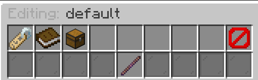
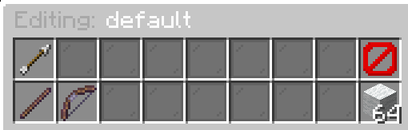

# Kits

Kits are a core feature of KnockBackFFA that define what items players have in their inventory when they spawn in the game. Each kit can be customized with different items, special abilities (through item modifiers), and boosts.

## Kit Management

### Creating a Kit

To create a new kit, use the command:

```bash
/kbffa kit create <name>
```

Replace `<name>` with your desired kit name. You'll be prompted to enter additional information like the kit's display name and description.

### Selecting a Kit

Players can select their kit using the command:

```bash
/kit
```

This opens a GUI showing all kits the player owns, where they can click to select one.

### Editing Kits

To modify existing kits, use:

```bash
/kbffa kit edit
```

This opens the kit selector where you can choose which kit to edit.

### Deleting a Kit

To delete a kit, use:

```bash
/kbffa kit delete <name>
```

Replace `<name>` with the kit you want to delete. Note that you cannot delete the default kit.

## Kit Economy System

Kits can be assigned prices and sold to players through your server's economy system:

- Set a price for each kit in the kit editor
- Players can purchase kits using in-game coins
- Free kits (like the default kit) should have a price of 0
- Players can only use kits they own

## Kit Editor GUI

The kit editor provides a visual interface to customize different aspects of a kit:



In this interface, you can:

### Basic Settings
- **Display Name**: The name shown to players in GUIs and messages
- **Description/Lore**: Information about the kit displayed in GUIs
- **Price**: Cost in coins for players to purchase this kit
- **Display Icon**: The item that visually represents the kit in menus

### Advanced Options
- **Inventory Editor**: Customize the items players receive with this kit
- **Manage Boosts**: Apply special abilities that affect players using this kit

## Inventory Editor

The inventory editor lets you customize what items appear in the player's inventory when using the kit:



### Adding Items
1. Click on an empty slot in the GUI
2. Drag the desired item from your inventory onto the slot
3. The item will be added to the kit in that slot position

### Modifying Items
1. Click on an existing item to open the [item modifier menu](./04-modifiers.mdx)
2. Apply special effects and behaviors to the item
3. Remove unwanted items by clicking the red "Delete Item" button

## Kit Boosts

Each kit can have special boosts attached to it that provide automatic effects when a player uses the kit. For more info go to the [Boosts section](./05-boosts.mdx).
## Configuration

All kit settings are stored in the `kits.yml` file. While the GUI is recommended, you can also edit this file directly.

### Tips for Kit Configuration

- **Default Kit**: Always maintain a free default kit for new players
- **Balance**: Test kits thoroughly to ensure they're balanced against each other
- **Variety**: Create different kits for different playstyles
- **Progression**: Design kit pricing to create a sense of progression
- **Visual Distinction**: Use different colored items or custom model data to make kits visually distinct

When players join the server, they automatically receive the default kit unless they've selected a different one. The active kit selection persists between sessions.