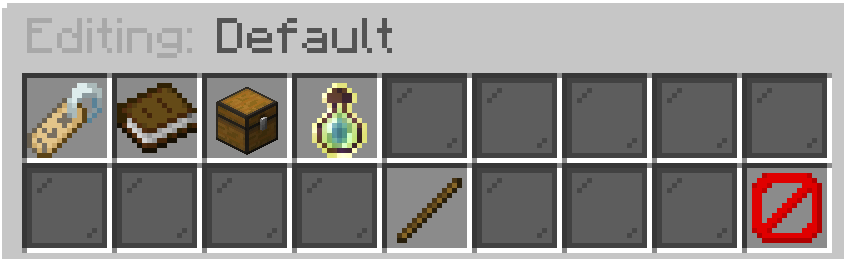
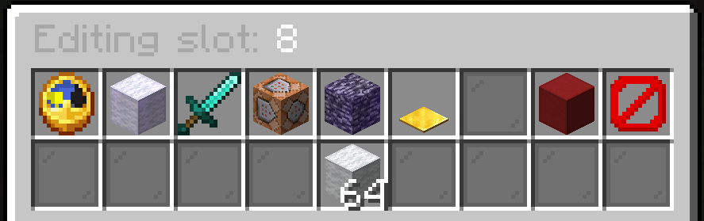

# Kits

Kits are also a big part of KnockBackFFA. They make it so players can have different items in their inventory when they join the game. In this guide, we will show you how to create and manage kits.

:::info[config]
Everything shown here can also be editted in the kits.yml file.
:::

## Creating a kit
To create a kit run the command:
`/kbffa kit create (name)`
Replace `(name)` with the name you want for the kit.

## Modifying a kit
To modify a kit run the command:
`/kbffa kit` and select the kit you want.\

### Kit editor
In the GUI openend when clicking on a kit you can modify the kit. You can modify the display icon, display name and lore of the kit.\

### inventory editor
You can also edit the items by clicking on the chest in the Kit editor. This opens the inventory selector. This is were you can select what slot of the inventory you want to edit.\

### item editor
Click on an item in the item editor to modify it. You can change the display name, lore, and the item itself. Additionally, there has been made an dynamic Modifier system. This system allows you to add custom modifiers to the item. The following modifiers are currently available:

- Delay Modifier: Adds a delay to an item (item must be a bow).
- BuildBlock Modifier: Makes the item buildblock.
  - A building block name should always start with `minecraft:white_` because the system changes `white_` to `yellow_`, then `orange_`, and finally `red_` before setting the block to air.
- On Kill Modifier: Restores item amount on kill.
- Execute Command Modifier: Executes a command on kill.
- Infinite Modifier: Makes the item infinite.
- JumpPad Modifier: A pressure plate that launches you upwards (item must be a pressure plate).
- More features are coming soon.

## Selecting a kit
You can select a kit by using the command `/kit`.

## Deleting a kit
You can for now only delete a kit by going into the kits.yml file and deleting it yourself but this will soon be replaced by /kbffa kit delete