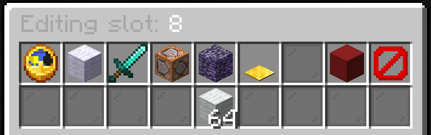

# Item Modifiers

Item modifiers are special properties that can be applied to items in a kit to give them unique abilities or behaviors. These modifiers are a powerful way to customize gameplay without needing to write custom plugins.

## Accessing Modifiers

To add or manage modifiers on an item:

1. Open the kit editor with `/kbffa kit`
2. Select a kit to edit
3. Click the chest icon to open the inventory editor
4. Click on an item to open the item editor
5. The available modifiers will appear in the top row of the GUI

## Available Modifiers

KnockBackFFA includes several built-in modifiers that can be applied to items:

### Delay Modifier
- **Purpose**: Adds a cooldown period between uses of an item
- **Compatible Items**: Primarily designed for bows
- **Configuration**: Set the delay time in seconds

### BuildBlock Modifier
- **Purpose**: Allows the item to place temporary blocks that decay over time
- **Notes**: Building blocks should start with `minecraft:white_` as the system changes the color from white → yellow → orange → red before removing the block
- **Configuration**: No additional configuration needed

### On Kill Modifier
- **Purpose**: Restores item amount/durability when the player gets a kill
- **Configuration**: No additional configuration needed

### Execute Command Modifier
- **Purpose**: Executes a specified command when certain conditions are met
- **Configuration**: Specify the command to execute
- **Variables**: Can use placeholders like `%player%` for the player's name

### Infinite Modifier
- **Purpose**: Makes the item have infinite uses (never gets consumed)
- **Configuration**: No additional configuration needed

### JumpPad Modifier
- **Purpose**: Creates a jump pad that launches players upward when stepped on
- **Compatible Items**: Pressure plates
- **Configuration**: Set jump height/power