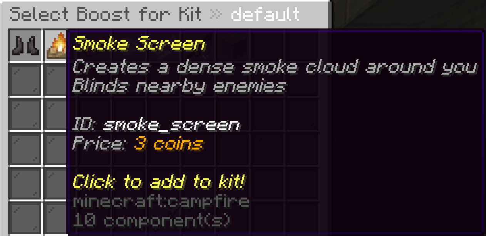

# Boosts

Boosts are powerful effects and abilities that enhance player gameplay in various ways. The plugin includes several types of boosts that can be:

- Given to players temporarily through shop purchases
- Applied permanently as part of kit abilities
- Configured to match your server's unique gameplay style

## Types of Boosts

The plugin includes several pre-made boosts:

- **Speed Boost**: Increases player movement speed
- **Jump Boost**: Enhances jump height
- **Knockback Resistance**: Reduces knockback received from attacks
- **Grappling Hook**: Allows players to pull themselves toward any surface
- **Leap**: Launches players forward in the direction they're facing
- **Smoke Screen**: Creates a blinding cloud that affects nearby players
- **Knockback Explosion**: Throwable item that knocks back nearby players

Boosts fall into two main categories:

- **Effect Boosts**: Apply potion or attribute effects to players (Speed, Jump, Resistance)
- **Item Boosts**: Give players special items they can use (Grappling Hook, Smoke Screen)

## Configuring Boosts

All boosts can be fully customized through the `boosts.yml` file located in your plugin directory.

### Basic Structure

```yaml
boosts:
  speed_boost:
    enabled: true
    name: "Speed Boost"
    description:
      - "Move faster around the arena"
      - "Gain a significant speed advantage"
    icon: RABBIT_FOOT
    price: 30
    speedAmplifier: 1
    particles: false
    ambient: true
```

### Common Configuration Options

Each boost has its own specific configuration options, but these are common to most boosts:

- `enabled`: Whether the boost is available in the game
- `name`: Display name of the boost
- `description`: List of description lines shown in tooltips
- `icon`: The Material that represents this boost in menus
- `price`: Cost to purchase this boost (in coins)

### Boost-Specific Options

Each boost type has unique properties you can customize:

#### Speed Boost
```yaml
speedAmplifier: 1  # Strength of the speed effect (0-255)
particles: false   # Whether to show particles
ambient: true      # Whether the effect is ambient
```

#### Knockback Explosion
```yaml
knockbackRadius: 8.0      # Explosion radius
knockbackStrength: 3.0    # How strongly players are thrown
fuseTime: 3               # Seconds until explosion
upwardKnockback: 0.3      # Vertical knockback component
```

#### Grappling Hook
```yaml
cooldown: 8           # Seconds between uses
pullStrength: 2.0     # How strongly players are pulled
maxYVelocity: 0.8     # Maximum upward velocity
upwardBoost: 0.2      # Additional upward boost
```

## Adding Boosts to Kits

To add boosts to kits:

1. Open the Kit Editor (`/kbffa kit edit <kitname>`)
2. Click the "Manage Boosts" button
3. Select the boosts you want to add to the kit
4. Players using this kit will automatically receive these boosts


## Editing Boosts via File

1. Open `boosts.yml` in your plugin directory
2. Find the boost you want to modify
3. Change its values as needed
4. Save the file
5. Use `/kbffa reload` to apply changes